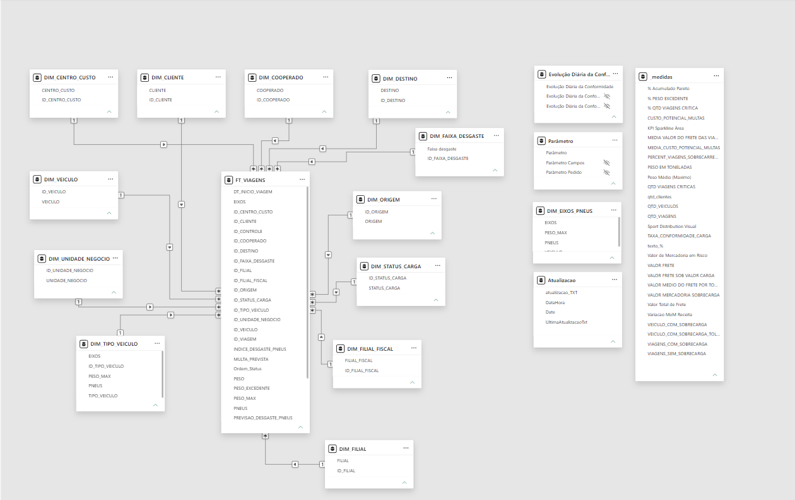

# 🚚 Dashboard de Gestão de Sobrecarga e Ativos

## 📌 Objetivo

Desenvolver uma solução analítica para monitorar operações logísticas, identificar riscos relacionados à sobrecarga de veículos e apoiar a tomada de decisão através de indicadores operacionais e financeiros.

---

## 📊 Escopo Analítico

- 100 mil+ registros processados
- 5 dimensões analíticas
- 8 KPIs desenvolvidos
- 3 páginas de dashboard
- SQL Server como fonte de dados
- Power Query para transformação
- DAX para construção de métricas
- Modelo dimensional para análise

---

## 📊 Visão Geral do Dashboard

### Visão Executiva de Risco e Conformidade


### Visão Operacional por Filial, Cliente e Unidade de Negócio


### Eficiência Operacional e Utilização de Ativos


---

## 🎯 Problema de Negócio

O transporte de cargas acima da capacidade permitida pode gerar:

* Multas e penalidades legais;
* Aumento do desgaste dos ativos;
* Custos operacionais elevados;
* Riscos de acidentes;
* Redução da vida útil da frota.

O projeto foi desenvolvido para fornecer uma visão consolidada dos riscos operacionais e da eficiência logística.

---

## 🛠 Tecnologias Utilizadas

* SQL Server
* Power BI
* DAX
* Power Query
* Modelagem Dimensional

---

## 🔄 Processo de Desenvolvimento

### Extração

Extração dos dados através de consultas SQL Server.

### Transformação

Tratamento dos dados utilizando Power Query:

* Padronização de campos;
* Tratamento de valores nulos;
* Aplicação de regras de negócio;
* Criação de colunas derivadas.

### Modelagem

Modelo dimensional desenvolvido para análise por:

* Filial
* Cliente
* Veículo
* Viagem
* Unidade de Negócio

---

## 🏗 Modelo de Dados



---

## 📈 Indicadores Desenvolvidos

* Total de Viagens Monitoradas
* Valor Total da Carga Transportada
* Valor da Carga em Risco
* Percentual de Viagens com Sobrecarga Crítica
* Receita Total de Frete
* Custo Potencial com Multas
* Índice de Desgaste de Pneus
* Aproveitamento de Capacidade dos Veículos

---

## 💡 Principais Insights

* Identificação de filiais com maior incidência de sobrecarga.
* Mapeamento de clientes com maior risco operacional.
* Estimativa do impacto financeiro associado às multas.
* Avaliação da eficiência operacional da frota.
* Monitoramento do desgaste de pneus relacionado ao excesso de carga.

---

## 📂 Estrutura do Projeto

```text
powerbi-logistics-dashboard
│
├── README.md
├── Gestão de Sobrecarga e Ativos.pbix
│
├── sql
│   └── consulta_principal.sql
│
├── power_query
│   └── editor_avancado.txt
│
├── docs
│   └── modelo_dados.png
│
└── imagens
    ├── visao_executiva.png
    ├── visao_operacional.png
    └── eficiencia_operacional.png
```

---

## 👨‍💻 Autor

**Tiago Dias**

Analista de Dados

Tecnologias:
SQL Server • Power BI • DAX • Power Query • Engenharia de Dados
